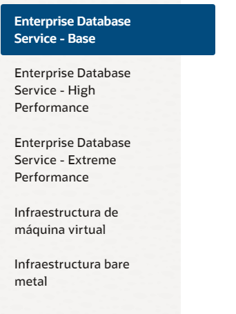
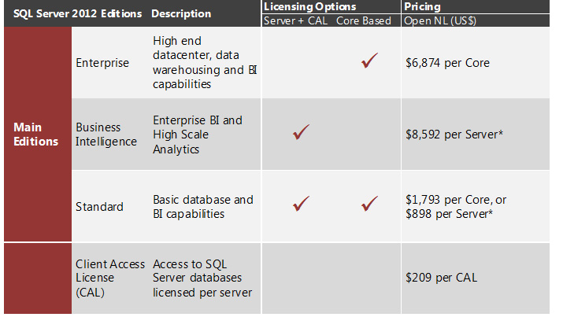
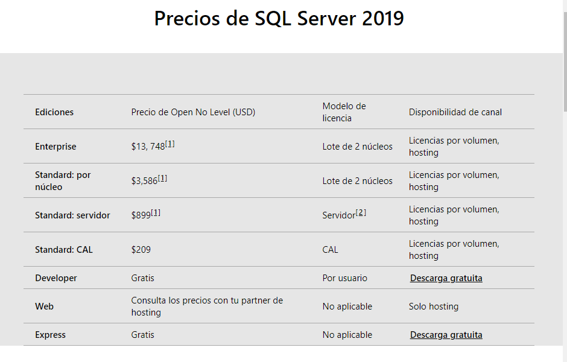

|     | MySQL    | PostgreSQL | Oracle |MicrosoftSQL Server|Cassandra|
| :------------- | :------------- | :------------- |:------------- |:------------- |:------------- |
| **Descripción** | MySQL es la base de datos de código abierto más popular del mundo. Ya sea una propiedad web de rápido crecimiento, un ISV tecnológico o una gran empresa, MySQL puede ayudarte de forma rentable a ofrecer aplicaciones de bases de datos escalables y de alto rendimiento.      |PostgreSQL es un potente sistema de base de datos relacional de objetos de código abierto con más de 30 años de desarrollo activo que le ha valido una sólida reputación de fiabilidad, solidez de las funciones y rendimiento. |Oracle es una herramienta para la gestión de bases de datos, usada principalmente por las grandes empresas para que estas puedan controlar y gestionar una gran cantidad de contenidos desde un solo archivo.|Microsoft SQL Server es un sistema de gestión de bases de datos relacionales que admite una amplia variedad de aplicaciones de procesamiento de transacciones, inteligencia empresarial y análisis en entornos informáticos corporativos. |Apache Cassandra es una base de datos distribuida NoSQL de código abierto en la que confían miles de empresas por su escalabilidad y alta disponibilidad sin comprometer el rendimiento.|
| **Plataformas disponibles**  | FreeBSD, Linux, OS X, Solaris, Windows. |Windows, Solaris, OS X, OpenBSD, Linux, Unix|Windows, Linux,Oracle Solaris, IBM, Mac OS X, Unix y BDS.|Linux Windows|BSD, Linux, OS X y Windows.|
| **Lenguajes de programación**      | C, C++, C#, Ada, Java, JavaScript, PHP, Python, Scheme |.Net, C, C++, Java, JavaScript, PHP, Python|C ,C# C++, Clojure, Cobol, Delphi, Eiffel, Erlang, Fortran, Groovy, Haskell, Java, JavaScript, PHP|C#, C++, Delphi, Go, JavaJavaScript (Node.js), PHP, Python|C#, C++, PHP, Python, Java, JavaScript, Ruby|
| **Utilización de almacenamiento**      | Aprox. 400 MB |277 MB|10,5 Gb de espacio en disco disponible y 2 Gb de RAM|8030 MB para almacenamiento e 1 GB de RAM|30,3 MB|
| **Ventaja** | Es una base de datos gratuita, fácil de usar y a su vez muy rápida , con pocos requerimientos de memoria RAM o CPU.  |Es capaz de ajustarse al número de CPU y a la cantidad de memoria disponible de forma óptima. Con ello logramos una mayor cantidad de peticiones simultáneas a la base de datos de forma correcta.|Oracle soporta todas las funciones que se esperan de un servidor "serio": un lenguaje de diseño de bases de datos muy completo (PL/SQL) que permite implementar diseños "activos", con triggers y procedimientos almacenados, con una integridad referencial declarativa bastante potente.|En el caso de una interrupción del suministro eléctrico o del apagado del servidor, los datos pueden corromperse, lo que representa un gran problema para las empresas que tienen pocas o ninguna copia de seguridad almacenada. Microsoft SQL Server elimina el riesgo de perder datos al tener funciones para la recuperación y restauración de datos. Como resultado, tendrá más tranquilidad al saber que sus datos están protegidos mediante el almacenamiento en caché.| La escalabilidad lineal y la tolerancia a fallos probada en hardware básico o infraestructura en la nube la convierten en la plataforma perfecta para los datos de misión crítica. |
| **Inconveniente**      | Al ser de Software Libre, muchas de las soluciones para las deficiencias del software no están documentados ni presentan documentación oficial.  |Es relativamente lento en inserciones y actualizaciones en bases de datos pequeñas, PostgreSQL está diseñado para ambientes de alto volumen. |El mayor inconveniente de Oracle es quizás su precio. Incluso las licencias de Personal Oracle son excesivamente caras, en mi opinión. Otro problema es la necesidad de ajustes. Un error frecuente consiste en pensar que basta instalar el Oracle en un servidor y enchufar directamente las aplicaciones clientes. Un Oracle mal configurado puede ser desesperantemente lento.|Existe una versión gratuita de Microsoft SQL Server que puede utilizar. Pero para aplicaciones y funciones más avanzadas basadas en datos, tendrá que realizar una inversión considerable en versiones superiores del software.|Debemos saber qué queries se van a ejecutar previamente, ya que al hacer SELECT sufre un poco debido a la manera en la que almacena los datos.|
| **Tipos de licencias**       | - Una versión **libre**: acceso libre a los fuentes del programa (open source) y **gratuito** . Se distribuye bajo licencia GPL desde la versión 3.23.19. - Una versión **comercial** de pago, con el nombre de MySQL Enterprise.  | Es de libre accseso y además no tiene versiones comerciales.||**Enterprise Edition** es ideal para aplicaciones que necesitan rendimiento en memoria, seguridad y alta disponibilidad críticos. **Standard Edition** ofrece funciones de base de datos completas para aplicaciones y data marts de nivel medio.|Es de libre acceso (gratis).|
| **Versión actual** | 8.0.26 |13.4|19c|15.0|3.11.11|
| **Precios en versiones comerciales** |    | 
X
|||
X
|
| **Imágenes**| |||||
