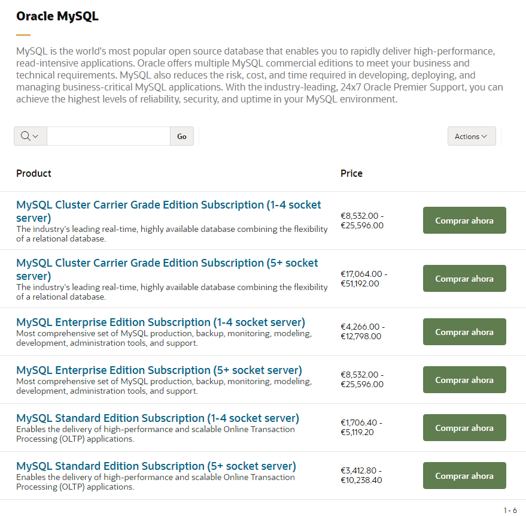
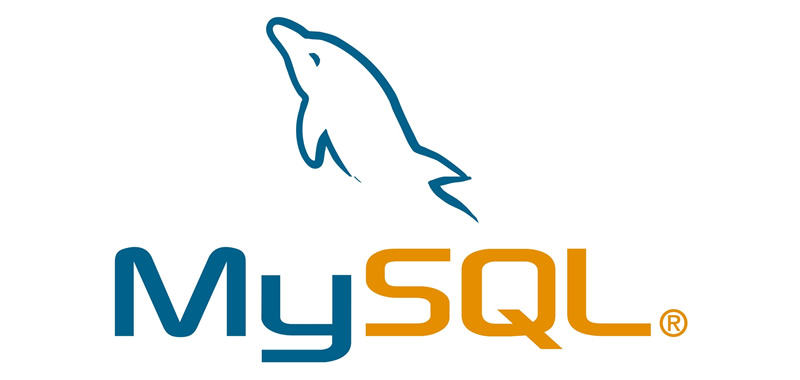
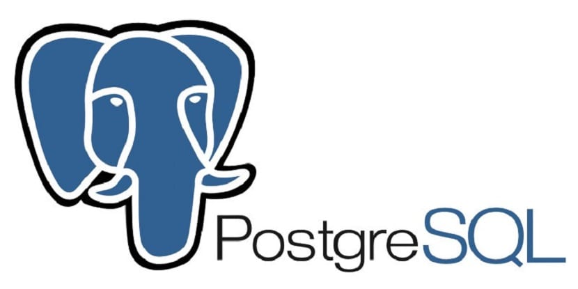
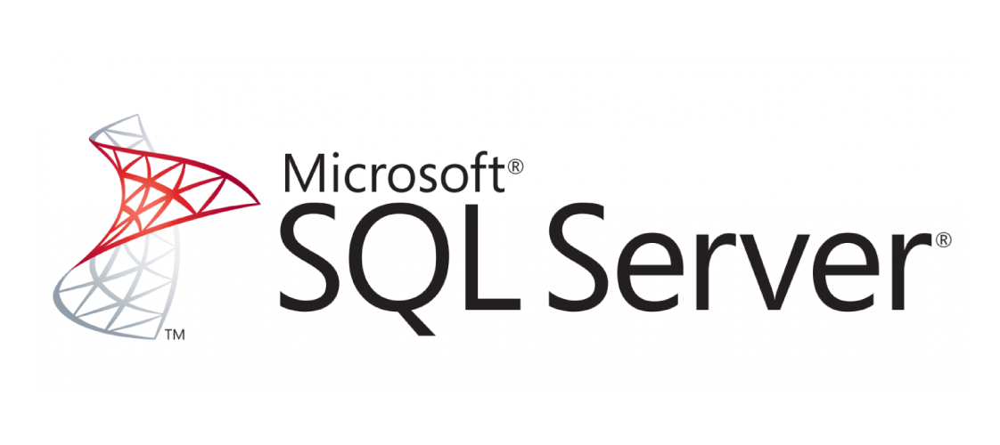
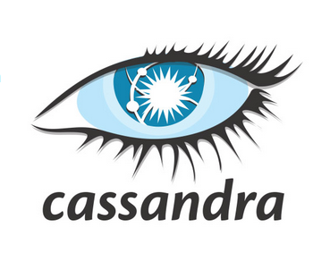

|     | MySQL    | PostgreSQL | Oracle |MicrosoftSQL Server|Cassandra|
| :------------- | :------------- | :------------- |:------------- |:------------- |:------------- |
| **Descripción** | MySQL es la base de datos de código abierto más popular del mundo. Ya sea una propiedad web de rápido crecimiento, un ISV tecnológico o una gran empresa, MySQL puede ayudarte de forma rentable a ofrecer aplicaciones de bases de datos escalables y de alto rendimiento.      |PostgreSQL es un potente sistema de base de datos relacional de objetos de código abierto con más de 30 años de desarrollo activo que le ha valido una sólida reputación de fiabilidad, solidez de las funciones y rendimiento. |caca|caca|Apache Cassandra es una base de datos distribuida NoSQL de código abierto en la que confían miles de empresas por su escalabilidad y alta disponibilidad sin comprometer el rendimiento.|
| **Plataformas disponibles**  | FreeBSD, Linux, OS X, Solaris, Windows. |Windows, Solaris, OS X, OpenBSD, Linux, Unix|||BSD, Linux, OS X y Windows.|
| **Lenguajes de programación**      | C, C++, C#, Ada, Java, JavaScript, PHP, Python, Scheme |.Net, C, C++, Java, JavaScript, PHP, Python|||C#, C++, PHP, Python, Java, JavaScript, Ruby|
| **Utilización de almacenamiento**      | Aprox. 400 MB |277 MB|||30,3 MB|
| **Ventaja** | Es una base de datos gratuita, fácil de usar y a su vez muy rápida , con pocos requerimientos de memoria RAM o CPU.  |Es capaz de ajustarse al número de CPU y a la cantidad de memoria disponible de forma óptima. Con ello logramos una mayor cantidad de peticiones simultáneas a la base de datos de forma correcta.||| La escalabilidad lineal y la tolerancia a fallos probada en hardware básico o infraestructura en la nube la convierten en la plataforma perfecta para los datos de misión crítica. |
| **Inconveniente**      | Al ser de Software Libre, muchas de las soluciones para las deficiencias del software no están documentados ni presentan documentación oficial.  |Es relativamente lento en inserciones y actualizaciones en bases de datos pequeñas, PostgreSQL está diseñado para ambientes de alto volumen. |||Debemos saber qué queries se van a ejecutar previamente, ya que al hacer SELECT sufre un poco debido a la manera en la que almacena los datos.|
| **Tipos de licencias**       | - Una versión **libre**: acceso libre a los fuentes del programa (open source) y **gratuito** . Se distribuye bajo licencia GPL desde la versión 3.23.19. - Una versión **comercial** de pago, con el nombre de MySQL Enterprise.  | Es de libre accseso y además no tiene versiones comerciales.|||Es de libre acceso (gratis).|
| **Versión actual** | 8.0.26 |13.4|||3.11.11|
| **Precios en versiones comerciales** |    | 
X
|||
X
|
| **Imágenes**| |||||
