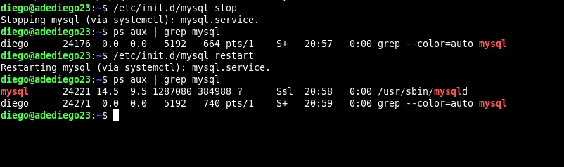

# **U1_A2.- Instalación de MySQL Server en Ubuntu Server 20.04 LTS**

## **1. Instalación y configuración de Ubuntu Server 20.04 LTS**

#### **1.1 Instalaremos un escritorio**

## **2. Instalamos MySQL Server**

## **3. Comprobamos la versión de MySQL**

## **4. Pararemos el demonio desde el init.d, comprobaremos de que el proceso este parado. Y lo reiniciamos**

## **5. Ejecutamos la siguiente consulta**

- Comprobamos que cuando entramos con ``mysql -u root -p`` ya no se autentifica usando el plugin ``auth_socket`` , sino ``mysql_native_password``, esto significa que el usuario root de MySQL se autentifica usando una contraseña.

## **6. Entraremos en la BD MySQL y modificaremos la tabla**

## **7. Instalamos MySQL Workbench y probaremos la conexión local con el servidor MySQL**

## **8. Instalamos Adminer sobre Apache y probaremos la conexión. Además instalaremos el PHPmyAdmin y comprobamos la conexión.**

## **9. Explicaciones finales.**

- **Directorio de instalación base**:

- Ejecutamos el siguiente comando ``sudo mysqladmin -u root -p shutdown``.

- Lo que sucede es que se apaga el servicio.

- **Directorio del servicio o proceso demonio, directorio alestar de MySQL.**

- **Directorio de datos**

- En este directorio se encuentran todos los datos, registros, estructura de tablas y bases de datos.

- **Fichero de configuración**

- **Propietario de las bases de datos**

